# 📚 Ứng Dụng Học Từ Vựng Tiếng Anh

<div align="center">
  
  
  <p><em>Một ứng dụng Flutter Desktop cho Windows giúp bạn học và ghi nhớ từ vựng tiếng Anh một cách hiệu quả thông qua các phương pháp khoa học.</em></p>
  
  
  
  
  
</div>

## �️ Demo Ứng Dụng Windows

<table>
  <tr>
    <td align="center">
      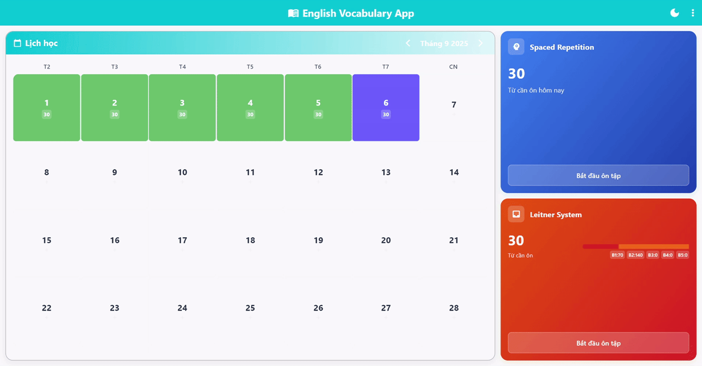
      <br/>
      <strong>Màn hình chính</strong>
    </td>
    <td align="center">
      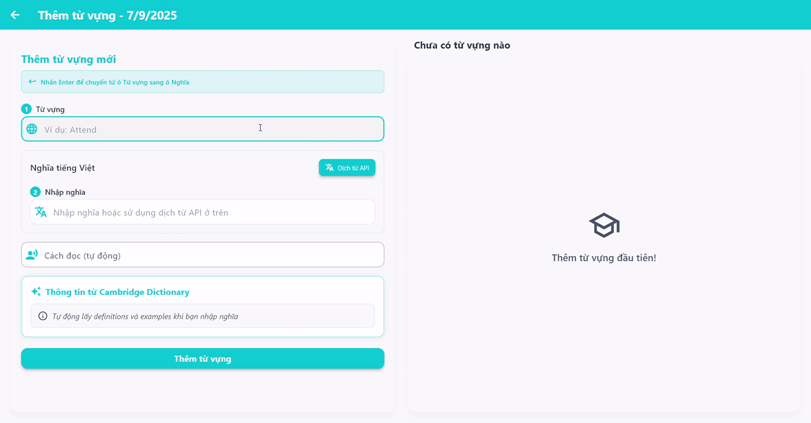
      <br/>
      <strong>Thêm từ vựng</strong>
    </td>
  </tr>
  <tr>
    <td align="center">
      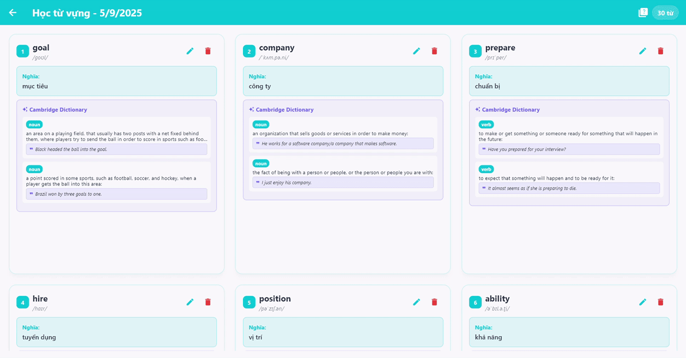
      <br/>
      <strong>Chế độ Quiz</strong>
    </td>
    <td align="center">
      
      <br/>
      <strong>Chuyển đổi theme</strong>
    </td>
  </tr>
</table>

## ✨ Tính Năng Chính

<div align="center">
  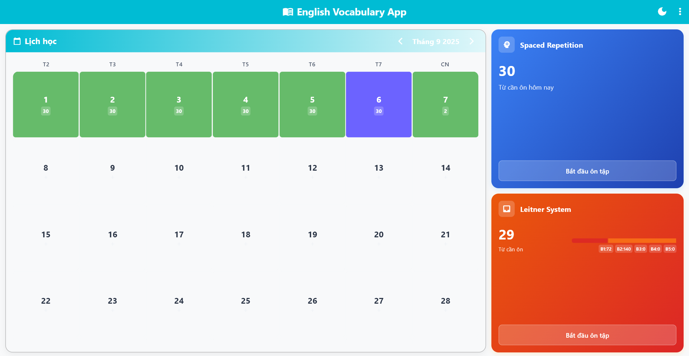
</div>

### 🎯 Phương Pháp Học Tập Khoa Học
- **Hệ thống Leitner**: Chia từ vựng thành 5 hộp theo mức độ thành thạo
- **Spaced Repetition**: Ôn tập theo khoảng cách thời gian tối ưu
- **Thuật toán SM-2**: Tự động điều chỉnh lịch ôn tập dựa trên khả năng ghi nhớ

<div align="center">
  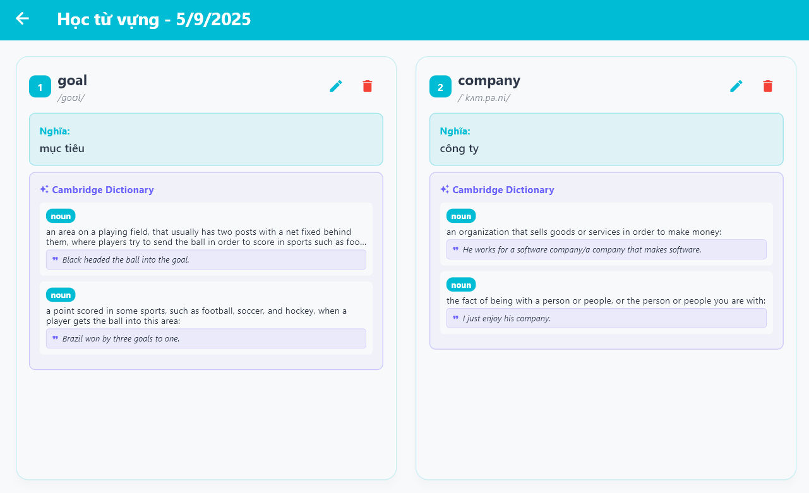
</div>

### 📖 Quản Lý Từ Vựng
- ➕ Thêm từ vựng mới với nghĩa, phiên âm, ghi nhớ và ví dụ
- ✏️ Chỉnh sửa và cập nhật từ vựng đã có
- 🔍 Tìm kiếm và lọc từ vựng theo nhiều tiêu chí
- 📊 Theo dõi tiến độ học tập chi tiết

### 🎮 Chế Độ Học Tập Đa Dạng
- **Quiz**: Kiểm tra kiến thức với câu hỏi trắc nghiệm
- **Flashcard**: Học theo thẻ ghi nhớ truyền thống
- **Ôn tập theo lịch**: Học theo lịch trình được tối ưu hóa
- **Kiểm tra nhanh**: Đánh giá nhanh mức độ hiểu biết

### 🎨 Giao Diện & Trải Nghiệm
- 🌙 Chế độ sáng/tối
- �️ Tối ưu cho màn hình desktop Windows
- ✨ Animation mượt mà và trực quan
- 🎯 UI/UX thân thiện và dễ sử dụng
- ⌨️ Hỗ trợ phím tắt Windows

<table>
  <tr>
    <td align="center">
      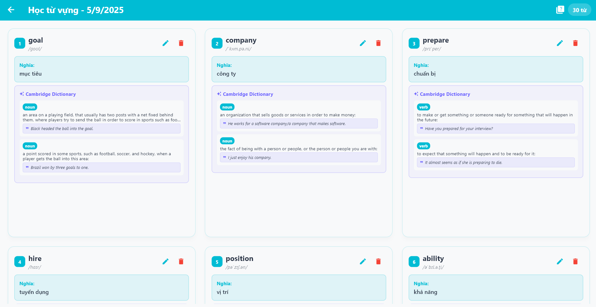
      <br/>
      <strong>Giao diện sáng</strong>
    </td>
    <td align="center">
      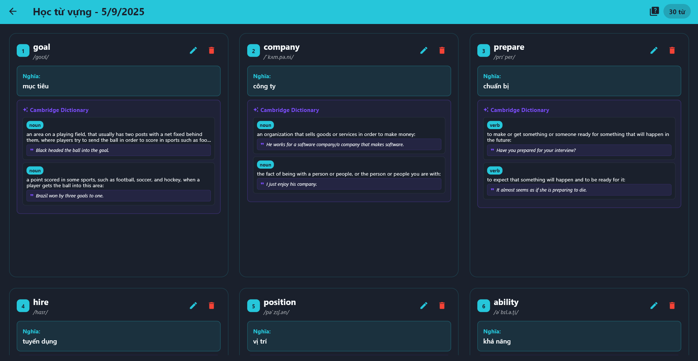
      <br/>
      <strong>Giao diện tối</strong>
    </td>
    <td align="center">
      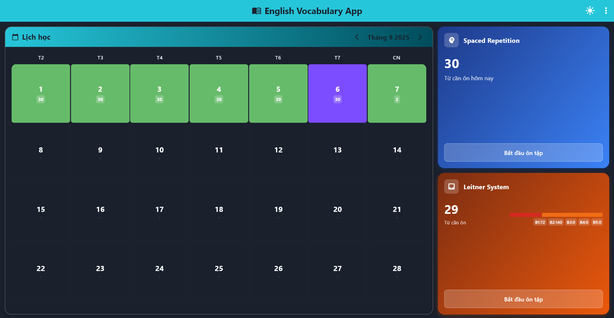
      <br/>
      <strong>Giao diện Desktop</strong>
    </td>
  </tr>
</table>

## 🛠️ Công Nghệ Sử Dụng

### Framework & Ngôn Ngữ
- **Flutter**: SDK phát triển ứng dụng desktop cho Windows
- **Dart**: Ngôn ngữ lập trình chính

### Thư Viện Chính
- `provider`: Quản lý state
- `shared_preferences`: Lưu trữ dữ liệu local
- `http`: Gọi API
- `flutter_animate`: Animation hiệu ứng
- `flutter_staggered_animations`: Animation danh sách
- `intl`: Xử lý ngày tháng và định dạng
- `json_annotation` & `json_serializable`: Xử lý JSON

## 📁 Cấu Trúc Dự Án

```
lib/
├── constants/          # Hằng số, theme và màu sắc
│   ├── colors.dart
│   ├── theme.dart
│   └── theme_provider.dart
├── models/            # Mô hình dữ liệu
│   └── vocabulary.dart
├── providers/         # Provider cho state management
│   └── theme_provider.dart
├── screens/           # Các màn hình chính
│   ├── home_screen.dart
│   ├── add_vocabulary_screen.dart
│   ├── learning_screen.dart
│   ├── quiz_screen.dart
│   ├── leitner_system_screen.dart
│   └── spaced_repetition_screen.dart
├── services/          # Logic xử lý nghiệp vụ
│   ├── vocabulary_service.dart
│   ├── leitner_service.dart
│   ├── spaced_repetition_service.dart
│   ├── dictionary_service.dart
│   └── translation_service.dart
├── widgets/           # Component tái sử dụng
│   ├── floating_vocab_widget.dart
│   ├── leitner_info_widget.dart
│   └── spaced_repetition_info_widget.dart
└── main.dart         # Entry point của ứng dụng
```

## 🚀 Cài Đặt & Chạy Dự Án

### Yêu Cầu Hệ Thống
- Flutter SDK (≥ 3.9.0) với Windows desktop support
- Dart SDK
- Windows 10/11 (64-bit)
- Visual Studio 2022 hoặc Visual Studio Build Tools
- Windows 10 SDK

### Hướng Dẫn Cài Đặt

1. **Cài đặt dependencies**
```bash
flutter pub get
```

2. **Sinh code từ JSON annotations**
```bash
flutter packages pub run build_runner build
```

3. **Chạy ứng dụng trên Windows**
```bash
flutter run -d windows
```

### Build Production

```bash
# Windows Desktop App
flutter build windows --release
```

> 📝 **Lưu ý**: File executable sẽ được tạo trong thư mục `build/windows/runner/Release/`

## 📚 Hướng Dẫn Sử Dụng

### 1. Thêm Từ Vựng Mới
<div align="center">
  
</div>

- Nhấn nút ➕ trên màn hình chính
- Nhập từ, nghĩa, phiên âm, ghi nhớ và ví dụ
- Lưu để thêm vào danh sách học tập

### 2. Ôn Tập Theo Spaced Repetition
<div align="center">
  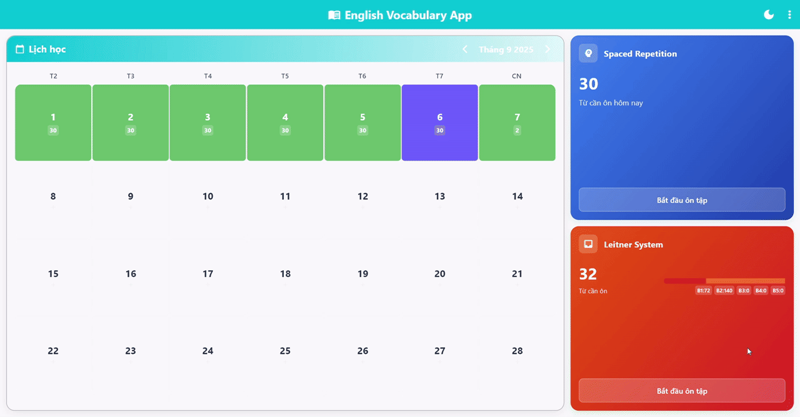
</div>

- Chọn "Ôn tập theo lịch"
- Hệ thống tự động tính toán thời gian ôn tập tối ưu
- Đánh giá mức độ nhớ từ để điều chỉnh lịch học

### 4. Kiểm Tra Kiến Thức
<div align="center">
  
</div>

- Chọn "Quiz" để làm bài kiểm tra
- Có thể lọc theo hộp Leitner hoặc trạng thái ôn tập
- Xem kết quả và phân tích chi tiết

### Hệ Thống Leitner
<div align="center">
  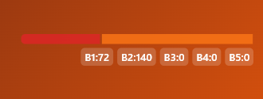
</div>

- **Hộp 1**: Từ mới, ôn lại mỗi ngày
- **Hộp 2**: Từ quen, ôn lại sau 3 ngày
- **Hộp 3**: Từ thuộc, ôn lại sau 1 tuần
- **Hộp 4**: Từ thành thạo, ôn lại sau 2 tuần
- **Hộp 5**: Từ hoàn thiện, ôn lại sau 1 tháng

### Spaced Repetition (SM-2)
<div align="center">
  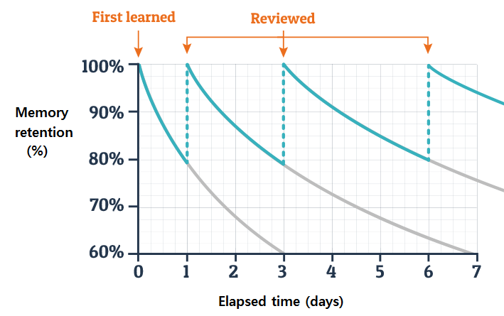
</div>

- Ease Factor: Bắt đầu từ 2.5
- Interval: Tăng dần theo công thức khoa học
- Quality: Đánh giá từ 0-5 điểm
- Tự động điều chỉnh lịch học dựa trên hiệu suất

## 📄 Giấy Phép

Dự án này dành cho mục đích học tập và sử dụng cá nhân.

## � Thông Tin Liên Hệ

- 📧 Email: [thanhtrieunguyen2004@gmail.com]
- 📱 GitHub: [thanhtrieunguyen]

## � Screenshots & Media

<details>
<summary>�️ Xem thêm screenshots Windows</summary>

## 🙏 Lời Cảm Ơn

Cảm ơn cộng đồng Flutter và các nhà phát triển đã tạo ra những thư viện tuyệt vời giúp xây dựng ứng dụng này!

---

<div align="center">
  
  
  **📚 Học từ vựng hiệu quả với khoa học! 📚**
  
  <a href="#top">🔝 Về đầu trang</a>
</div>
